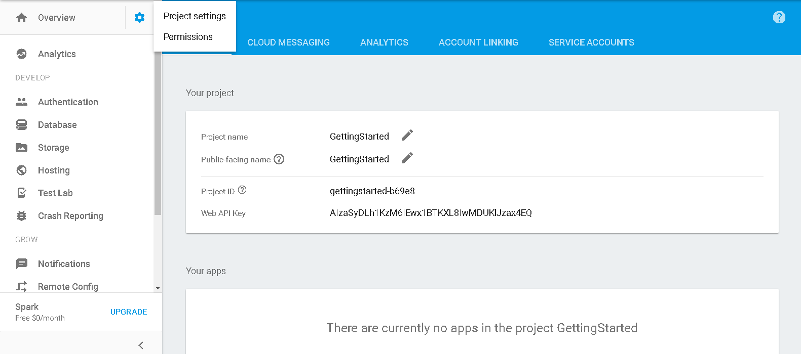
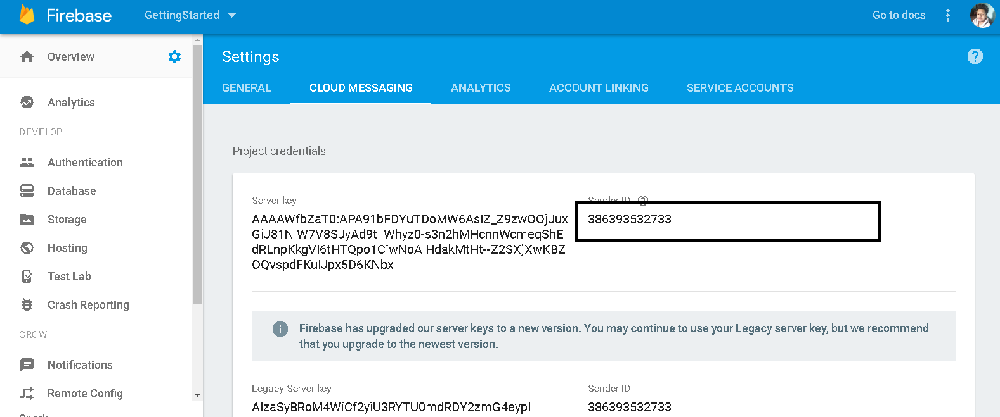
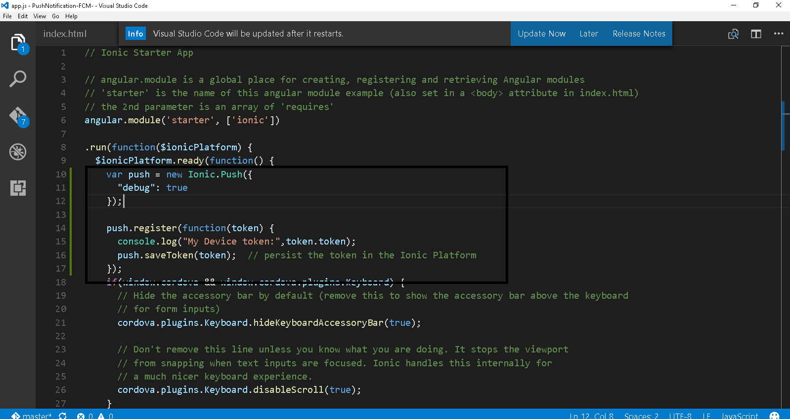
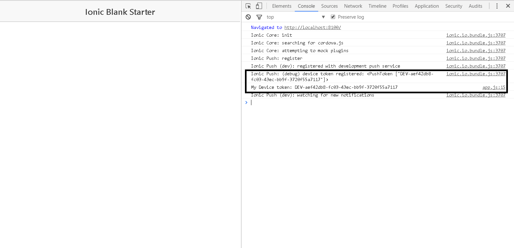
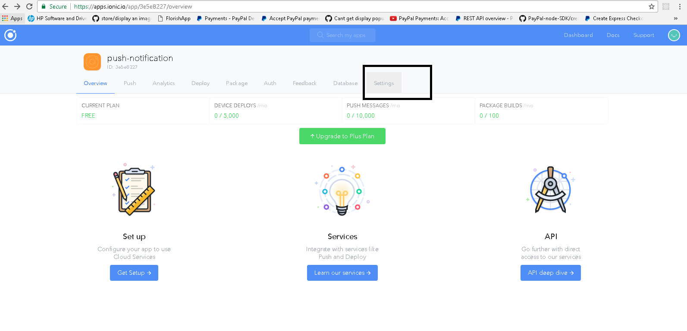
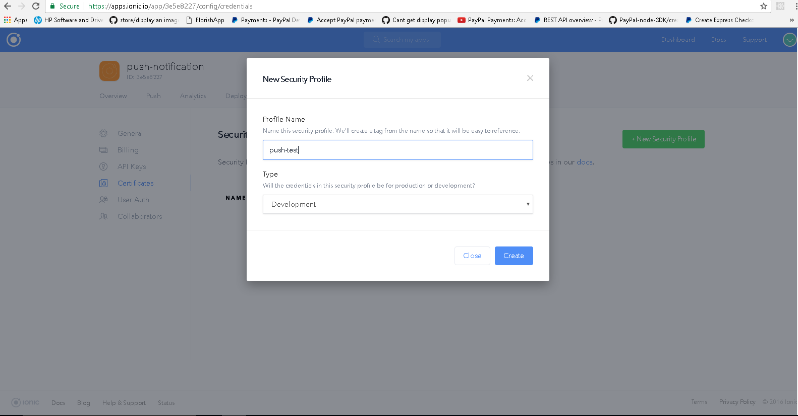
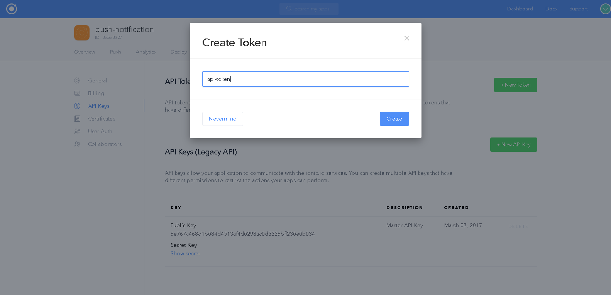
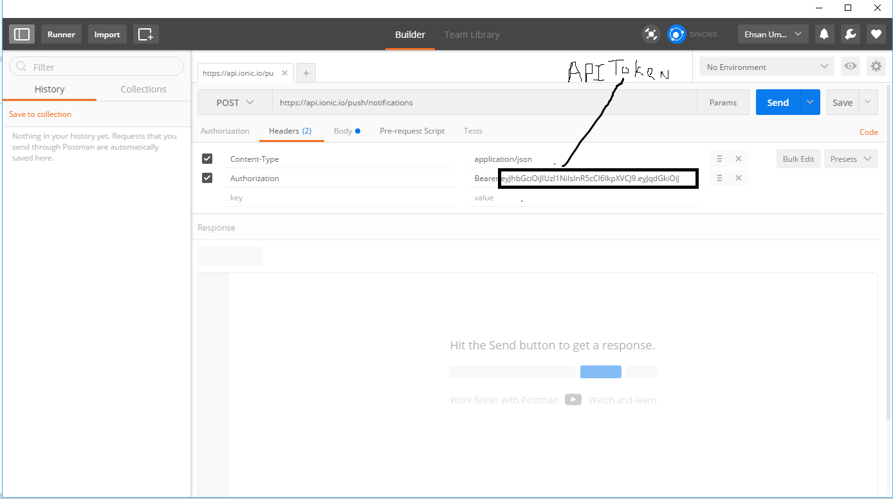
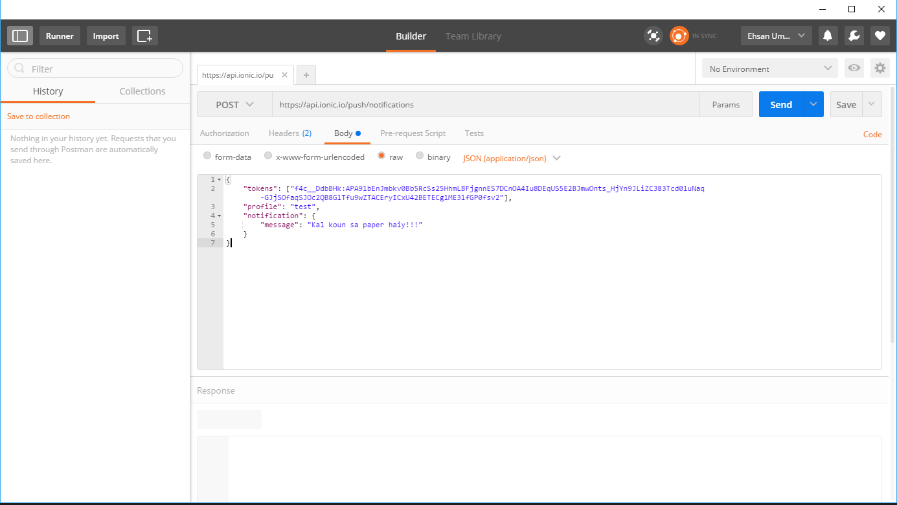
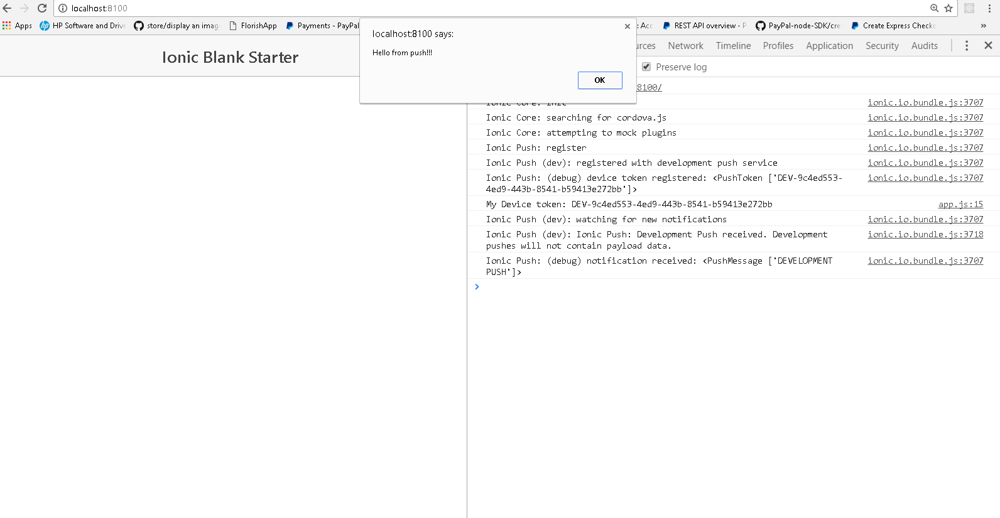

# PushNotification-FCM-

#Ionic Push Notification
Create a new ionic project 
ionic start push-notification blank 
navigate to your project (cd push-notification) 
Add this plugin  
ionic add ionic-platform-web-client  
Now you need to get your senderID of your firebase base project  
Go to firebase console (https://firebase.google.com/) and create a new project  
Get your senderID from Project Settings of your firebase project  

  
  

Inside Cloud Messaging tab you can get your senderId  

  
  

 
Now we get our senderId from our firebase project add phonegap-plugin-push with your senderId
ionic plugin add phonegap-plugin-push --variable SENDER_ID="SENDER_ID of your project"

Alright, the basic is done, let’s connect our app to the <a href="">Ionic.io</a> services!

If you have no account there, now is the time. It’s free and you need it in order to send Ionic push notifications to your app.

After creating your ionic.io account then continue on your command line and run:
ionic io init
ionic config set dev_push true

First of all this will create an app id inside your Ioni.io dashboard, and we also enable Dev Pushes for our app to test if everything works until now.
Open up your app.js and replace the current .run() block with this:

  
  

We create a new Push object and register ourself. On success, we will log our device token which we need to send push notifications to.

After all this step run ionic serve and go to your chrome console by pressing f12 you can see your device token for web there

  
  

To test our app we need to use the Dev Push,but first we need to add a security profile and create an API key inside the ionic.io dashbaord
Go to your created App inside ionic.io dashboard click on Settings and in the submenu certificates

  
  

  
  

Now we need an API key to talk to the ionic.io services from outside, so now go to API Keys and create a New Api Token

  
  

Now we are already able to send our Dev Push, so go ahead and run your app with ionic serve or on a device, and observe the log for our Dev Token!

Now we can send a push using postman request, the 3 things we need to have are:

DEV_DEVICE_TOKEN: The one which we get from our app console.
PROFILE_NAME: The name of our security profile.
API_TOKEN: The API token which we created.

run ionic serve and get your DEV_DEVICE_TOKEN from your chrome console and test your push notification
#first we need to set the headers of our request
Content-Type       application/json
Authorization      Bearer "Api_Token which you created inside your ionic.io app"

  
  

#Now we need to add the body of our request

{
    "tokens": ["Device token which we get from our app console"],
    "profile": "name of our app which we created for our app inside ionic.io",
    "notification": {
        "message": "Hello from push!!!"
    }
}

  
  

"https://api.ionic.io/push/notifications" the URL where we post our request for push

Now you can see your notification in your browser like this

  
  

